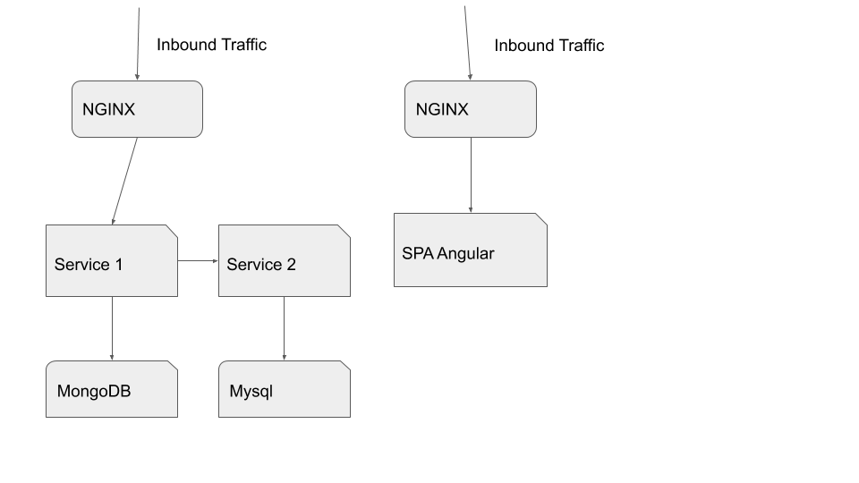

# Main definitions and goal
 
We have a Single-page application. To be able to gain velocity and fiability we want to deploy a DevOps policies going from Continuous Integration to Continuous deployment.
 
 * Continuous Integration: we'll go through all the Quality checks needed.
 * Continuous Delivery: we'll create a **delivery** (packaged application). In our case, the delivery will be done inside a container
 * Continuous Deployment: we want to deploy automatically the new version of the defined package inside the defined system
 
# Current state
We actually deploy 3 different applications :
 * 1 Rest API expose to the external flow connected to a MongoDB
 * 1 Rest API exposed to the internal flow connected to a Mysql, use by the first API
 * 1 WebApp Single page.
 

# Problems :
 * We have some 500 errors and can’t reproduce the actual error to debug it as they are inconsistent. But they only happen when using Service 1 and Service 2
 * We want to be able to roll out new versions faster
 * We have frequent uses with MongoDB (response time and space mostly)
 * We’d love to be able to do A/B on the front (angular app)
 * We some times have inconsistencies within our dependencies and containers.
 * The CTO and CEO have to connect to the services and DB to validate their disponibility (response time) often to be reassured.
 

# Definition of Done 
The expected result is a infrastructure graph with the services/solutions used to solve the problems with the explaination.

A roadmap of their deployment (which one come first and which one come last) if their some complexity or long term gains.
